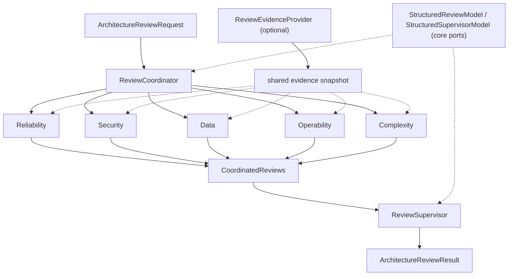

# Architecture Review Board

Architecture Review Board is a provider-neutral architecture assessment system that runs
independent specialist reviews in parallel, preserves their findings and disagreements, and
produces a structured, supervised decision.

It is a structured multi-reviewer assessment workflow, not autonomous architecture approval, not
a chatbot, not a coding agent, and not a generic agent framework. Its output is an advisory,
auditable recommendation for human architecture review, not a deployment authorization or a
replacement for organizational governance.

## Why this exists

Most multi-model review setups work by having several models converse and one summarize the
conversation. That collapses independent judgment into a negotiated transcript before a human
ever sees where the reviewers actually disagreed. Architecture Review Board keeps the five
specialist assessments structurally independent and represents disagreement as data, not as
something argued away in a chat log.

## Design principles

- **Independent assessment, not conversation.** Five specialist reviewers see the same proposal
  and the same optional evidence snapshot; none sees another's output. There is no
  `Message`, `Conversation`, or shared scratchpad, and no conversational transcript is required
  for correctness.
- **Explicit reconciliation, not silent consensus.** A supervisor reconciles the five
  independent results into conditions, blocking findings, and a decision, and can surface a
  disagreement instead of forcing one.
- **Structured output only.** Every model boundary exchanges validated Pydantic objects. There
  is no free-text parsing, no markdown scraping, no `json.loads` over raw model text.
  Application code, not the model, owns finding/condition/disagreement identity.
- **Provider-neutral core.** The domain and application layers depend only on small ports
  (`StructuredReviewModel`, `StructuredSupervisorModel`, `ReviewEvidenceProvider`). Concrete
  providers are reference adapters, wired only at the CLI's composition root.
- **Fail loud, degrade honestly.** Expected provider/execution failures are represented
  explicitly in the result; unexpected programming errors are never silently absorbed.

## Architecture



Dashed lines mark optional/pluggable boundaries. Nothing about the five specialists or the
supervisor requires a specific model provider or an evidence provider to exist; `ReviewCoordinator`
and `ReviewSupervisor` depend only on the two structured-model ports above.

The five specialists run **concurrently** inside `ReviewCoordinator`. Each receives the same
`ArchitectureReviewRequest`, the same evidence snapshot (if any), and its own trusted rubric text,
and nothing else: no reviewer sees another reviewer's output, and task completion order never
controls the public result order. `CoordinatedReviews`, and the final `ArchitectureReviewResult`,
always present the five dimensions in one canonical order:

    RELIABILITY, SECURITY, DATA, OPERABILITY, COMPLEXITY

This independence is a software-architecture property, not a claim about scientific
independence: it reduces cross-review anchoring (one reviewer's phrasing coloring another's) and
keeps disagreement observable in the result instead of negotiated away during a conversation
that never happened.

## Review dimensions

| Dimension | Focus |
|---|---|
| RELIABILITY | failure modes, containment, recovery, degradation, capacity, consistency under failure |
| SECURITY | trust/privilege boundaries, authorization assumptions, secrets, exposure, attack surface |
| DATA | ownership, source of truth, consistency, durability, lifecycle, migrations/reconciliation |
| OPERABILITY | observability, diagnostics, rollback, configuration, ownership, maintenance |
| COMPLEXITY | coupling, moving parts, cognitive/operational burden, unnecessary generalization, whether sophistication is justified |

## Decision model

- **APPROVE**: no blocking findings and no conditions.
- **APPROVE_WITH_CONDITIONS**: may proceed once explicit, referenced conditions are satisfied.
- **REQUEST_CHANGES**: material findings must be addressed before approval.

There is no `REJECT` in v0.1.0: architecture review generally asks for revision, not permanent
rejection of a problem space. This is advisory structured output for human review, not an
automated deployment authorization.

**Incomplete-board safety.** If one or more specialists fail in an expected way, the successful
reviewers' results remain available, the failed dimensions become explicit
`SpecialistReviewFailure` entries, and the supervisor still runs. An unconditional `APPROVE` is
structurally invalid whenever the board is incomplete. Incomplete coverage does **not**
automatically become `REQUEST_CHANGES`, and there is no hidden severity-count or voting formula
deciding it either way; the supervisor still weighs the case.

## Failure semantics

| Situation | Behavior |
|---|---|
| Expected specialist model/application failure | isolated as one `SpecialistReviewFailure`; other specialists continue |
| Expected evidence-provider failure | `evidence_context=UNAVAILABLE`; the board continues without external evidence |
| Expected supervisor inability to produce a result | no `ArchitectureReviewResult` is fabricated; the error propagates |
| Unexpected programming error | propagates and fails loudly; never silently degraded |

## Structured model boundaries

Specialist models return `SpecialistReviewDraft`; the supervisor model returns
`SupervisorReviewDraft`. Neither draft can set finding IDs, condition IDs, disagreement IDs,
reviewer identity for a specialist finding, or an evidence provenance object; application code
assigns and validates all of those before anything becomes part of a domain object. Both are
plain, `extra="forbid"` Pydantic models exchanged through the model SDK's structured-output
support; there is no free-text parsing anywhere on this path.

**OpenAI** is one reference provider for these ports, not the architecture engine. The core
interfaces are `StructuredReviewModel` and `StructuredSupervisorModel`; the current CLI
composition root wires a concrete `OpenAIStructuredReviewModel` against both, but nothing in the
domain or application layers requires OpenAI, and it is only installed through the `openai`
extra. No alternative provider is implemented in this repository yet.

## Trust boundaries

`ArchitectureReviewRequest` content, specialist-produced text as seen by the supervisor, and
`ReviewEvidence` excerpts are all untrusted data. Trusted reviewer/supervisor rubric text is
kept structurally separate from that data at the model boundary (instructions vs. input), never
concatenated into one prompt. Model calls have no tools enabled, so nothing in a proposal or an
evidence excerpt can trigger an action; MCP evidence retrieval happens entirely outside model
execution. This maintains instruction/data role separation and avoids tool execution from
untrusted review content; it is not a claim of complete prompt-injection prevention.

See [docs/trust-boundaries.md](docs/trust-boundaries.md) for the full breakdown, including the
concrete controls (bounded drafts, evidence ID/reference validation, MCP environment allowlisting,
no shell execution, bounded timeouts, sanitized error detail).

## Optional evidence integration

Architecture Review Board owns one provider-neutral port, `ReviewEvidenceProvider`. An
`EngineeringKnowledgeMcpEvidenceProvider` reference adapter is included, speaking MCP stdio to
an external engineering-knowledge server's `search_knowledge` tool; ARB never imports that
project's Python package and does not choose lexical/vector/hybrid retrieval, which stays that
server's own configuration.

At most one evidence search happens per review. Its result becomes one bounded, immutable
snapshot shared identically by all five specialists: never per-reviewer retrieval, never a
model-initiated tool call. A specialist may reference a supplied `evidence_id` in a finding; it
cannot construct a `ReviewEvidence` object itself. Application code resolves each referenced ID
to the exact evidence object it was given, so provenance is always application-owned, not
model-generated. For the engineering-knowledge adapter, `source_reference` preserves the
upstream source/document/chunk/section provenance as a compact deterministic JSON string.

Any other system can implement `ReviewEvidenceProvider` without depending on ARB internals.

## Installation

These are local/repository installation instructions; this project is not currently published
to PyPI.

```bash
# base (domain, coordination, supervision, evaluation harness, CLI argument parsing)
pip install -e .

# development tooling (pytest, ruff, mypy)
pip install -e ".[dev]"

# OpenAI reference model adapter
pip install -e ".[openai]"

# OpenAI + engineering-knowledge MCP evidence adapter
pip install -e ".[openai,mcp]"

# full development environment
pip install -e ".[dev,openai,mcp]"
```

The base install works without `openai` or `mcp` installed: domain, coordination, supervision,
the evaluation harness, and `architecture-review-board --help` all work. Optional SDKs are only
imported when a command actually needs the capability they provide.

## Environment configuration

```
OPENAI_API_KEY
ARCHITECTURE_REVIEW_BOARD_MODEL
ARCHITECTURE_REVIEW_BOARD_EVIDENCE
ARCHITECTURE_REVIEW_BOARD_EVIDENCE_COMMAND
ARCHITECTURE_REVIEW_BOARD_EVIDENCE_ARGS
ARCHITECTURE_REVIEW_BOARD_EVIDENCE_ENV_ALLOWLIST
```

`.env.example` documents these variable names for reference; the application does not load
`.env` files automatically (no `python-dotenv` dependency), and there is no `--api-key` flag.
Secrets come from the process environment only. The MCP evidence child process receives an
environment built only from `ARCHITECTURE_REVIEW_BOARD_EVIDENCE_ENV_ALLOWLIST`, never a copy of
the parent process's environment, so `OPENAI_API_KEY` never reaches it unless explicitly
allowlisted (which is never necessary and not recommended).

## Quick start

```bash
export OPENAI_API_KEY=...
export ARCHITECTURE_REVIEW_BOARD_MODEL=<model-id>

architecture-review-board review examples/review_request.json
```

`<model-id>` is a placeholder: pass whatever current model identifier your OpenAI account has
access to through the Responses API. Machine-readable output:

```bash
architecture-review-board review examples/review_request.json --json
```

With an evidence provider configured:

```bash
architecture-review-board review examples/review_request.json \
  --model <model-id> \
  --evidence mcp \
  --evidence-command engineering-knowledge \
  --evidence-args "--config engineering-knowledge.toml"
```

This assumes an `engineering-knowledge` server is installed and configured separately; ARB does
not install or configure it for you.

## CLI

Two commands: `review` and `evaluate`.

**`architecture-review-board review <path|->`**: reads a JSON `ArchitectureReviewRequest` from
a file path or `-` for stdin, runs the full board, and prints the result. Key flags: `--model`,
`--evidence {disabled,mcp}`, `--evidence-command`, `--evidence-args`, `--evidence-env-allowlist`,
`--json`.

**`architecture-review-board evaluate <dataset.json>`**: runs an explicit evaluation dataset
path through the same composition as `review` and prints an `EvaluationReport`. Additional
flags: `--repetitions` (default `1`), `--json`.

Run `architecture-review-board review --help` / `evaluate --help` for the full flag reference.

**Exit codes.** A valid `ArchitectureReviewResult` exits `0`, including `REQUEST_CHANGES` and a
result with specialist failures represented in it. A valid `EvaluationReport` exits `0` too, even
with failed case runs or weak metrics inside it. Decision quality and benchmark quality are not
Unix process health; a non-zero exit means the requested result could not be produced at all
(configuration/input/dataset error, or an execution failure the application does not classify
as recoverable).

## Evaluation

`architecture-review-board evaluate evaluation/golden_v0_1.json` runs the versioned, synthetic
golden dataset through the real `ArchitectureReviewService`. See
[evaluation/README.md](evaluation/README.md) for the dataset's cases, the deterministic lexical
matcher and its limitations, exact metric denominators, and the dataset/rubric integrity rule.

The repository includes a reproducible evaluation harness and a fixed golden dataset (fingerprint
`96be2ec7bed747f9339844889818530a055eb880f5ac2c0ff9f29d1c5b74d17f`). A hosted-model baseline has
not yet been recorded in this repository.

## Project scope

See [PROJECT_SCOPE.md](PROJECT_SCOPE.md) for the full v0.1.0 boundary.

## Development

```bash
pip install -e ".[dev,openai,mcp]"
ruff check src tests
mypy src --strict
pytest -q
```

See [docs/architecture.md](docs/architecture.md) for package layering, concurrency, and failure
semantics in more depth than this README.

## Status

Pre-alpha, v0.1.0. Core review workflow, evaluation harness, and CLI are runnable with optional
concrete providers. No persistence, no web/API server, no telemetry platform.
