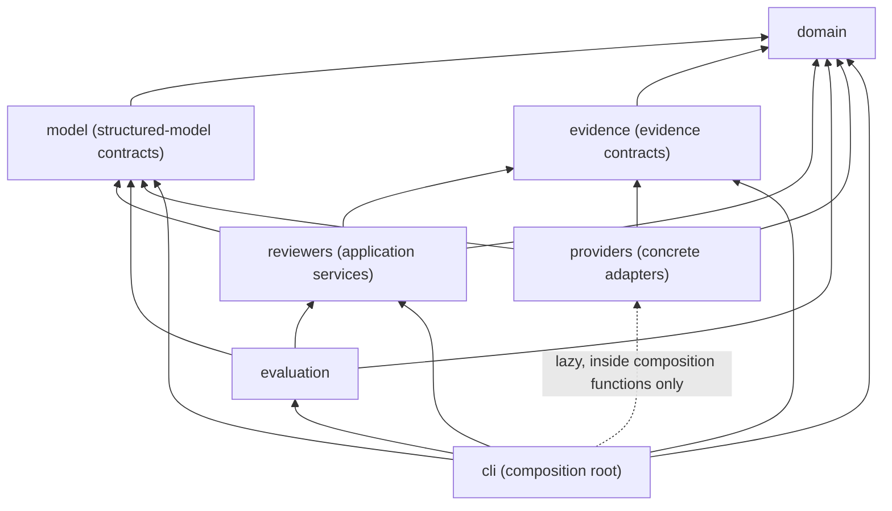

# Architecture

This document goes deeper than the README: package layering, execution semantics, identity
schemes, and the evaluation/CLI boundaries, as the code actually implements them.

## 1. System boundaries

Architecture Review Board has three kinds of boundary:

- **Core ports**: `StructuredReviewModel`, `StructuredSupervisorModel`
  (`model/base.py`, `model/supervisor.py`), and `ReviewEvidenceProvider`
  (`evidence/provider.py`). These are `Protocol` types the application layer depends on;
  nothing in `domain/`, `model/`, `evidence/`, `reviewers/`, or `evaluation/` imports a concrete
  provider.
- **Reference adapters**: `OpenAIStructuredReviewModel` and
  `EngineeringKnowledgeMcpEvidenceProvider` (`providers/`), each behind its own optional
  dependency (`openai`, `mcp`), imported nowhere else in the codebase.
- **Composition root**: `cli/composition.py`, the one module allowed to import a concrete
  provider, and only inside the functions that build one, not at module import time.

## 2. Domain model

`domain/models.py` and `domain/enums.py` hold the public data contracts:
`ArchitectureReviewRequest`, `ReviewEvidence`/`ReviewEvidenceQuery`/`ReviewEvidenceSearchResult`,
`ReviewFinding`, `SpecialistReview`, `SpecialistReviewFailure`, `ReviewCondition`,
`ReviewerPosition`/`ReviewDisagreement`, and `ArchitectureReviewResult`. Every model is a frozen
Pydantic model with `extra="forbid"`. `ArchitectureReviewResult` carries the heaviest invariant
set: full five-dimension coverage in canonical order, no dimension both succeeding and failing,
unique finding IDs, blocking/condition/disagreement references resolving to real findings,
disagreement positions owned by the reviewer that raised them, evidence citations resolving to
the shared snapshot, and decision/coverage consistency (see sections 5 and 7). These are
structural consistency checks; the domain layer never decides what a review's outcome *should*
be.

## 3. Specialist execution

`SpecialistReviewer` (`reviewers/specialist.py`) turns one `SpecialistReviewDraft` into one
`SpecialistReview`. It owns two identities the model is never allowed to choose:

- **Reviewer identity.** `ReviewFindingDraft` has no `reviewer` field; every mapped
  `ReviewFinding.reviewer` is stamped from the reviewer's own configuration, so a model can
  never claim a dimension other than the one it was invoked for.
- **Finding identity.** IDs are assigned deterministically from draft order:
  `f"{reviewer.value}-{index:03d}"` (`reliability-001`, `reliability-002`, ...), 1-indexed,
  never requested from the model, never a UUID or a hash.

Evidence works the same way: `ReviewFindingDraft.evidence_ids` may only reference IDs from the
`available_evidence` tuple the reviewer was given; an unknown ID raises
`SpecialistReviewerError` rather than silently dropping or fabricating evidence.

## 4. Concurrency

`ReviewCoordinator.review()` (`reviewers/coordinator.py`) runs the five specialists inside one
`asyncio.TaskGroup`, each writing its outcome into a list pre-sized and indexed by canonical
position, not appended on completion. That is what makes result order independent of completion
order: even if COMPLEXITY finishes first and RELIABILITY last, the outcome list's positions are
fixed before any task runs, so `CoordinatedReviews.reviews`/`.failures` always come out in
`REVIEW_DIMENSION_ORDER`, a `model_validator` invariant it also enforces on construction. The
coordinator does not orchestrate; it is only the boundary that makes five independent async
calls and reassembles their results deterministically.

## 5. Failure semantics

Two failure types are treated as *expected specialist outcomes*, caught inside each task and
converted into a `SpecialistReviewFailure` (stable detail `"specialist review unavailable"`,
never the raw exception) rather than aborting the board:

- `StructuredReviewModelError`: the provider could not produce structured output at all.
- `SpecialistReviewerError`: it did, but the draft violates an application invariant (for
  example, an unknown evidence reference).

Both mean the same thing to `ReviewCoordinator`: this dimension's output was not usable, and the
board continues without it. Anything else escapes the `except` clause, and `TaskGroup` cancels
the remaining specialists and re-raises as an `ExceptionGroup`; an unexpected defect is never
silently downgraded into a coverage gap.

At the supervisor layer, `StructuredSupervisorModelError` (provider produced nothing usable) and
`ReviewSupervisorError` (it produced a structurally valid draft that violates a board invariant,
such as an unknown reference, a wrong-reviewer disagreement position, or a decision inconsistent
with coverage) are the two expected outcomes that prevent an `ArchitectureReviewResult`; neither
is ever converted into a fabricated result. `ArchitectureReviewService` applies the same pattern
to evidence: `ReviewEvidenceUnavailableError` from the provider becomes
`evidence_context=UNAVAILABLE`, and the board runs on with `available_evidence=()`.

## 6. Supervisor reconciliation

`ReviewSupervisor.review()` (`reviewers/supervisor.py`) builds a `SupervisorModelRequest` from
the specialist results, awaits one `SupervisorReviewDraft`, stamps condition/disagreement
identity, and constructs `ArchitectureReviewResult`. It never rewrites a specialist finding's
severity, confidence, recommendation, or evidence: `SpecialistReview` objects pass through
unchanged and are referenced only by `finding_id`. Any resulting domain `ValidationError` (bad
reference, wrong decision shape, malformed disagreement) is translated to `ReviewSupervisorError`
with a generic message, chaining the original error rather than exposing it.

## 7. Disagreement representation

A `ReviewDisagreement` requires at least two unique-reviewer `ReviewerPosition` entries;
`resolution` may stay `None`, since the supervisor is not required to force consensus. The
domain model additionally enforces, at the full-result level (only it has enough context to
check this): a position's reviewer must have an actual `SpecialistReview` in the result (a
failed dimension cannot be given a fabricated position), and every finding ID a position
references must belong to that same reviewer, not borrowed from another dimension's findings.

## 8. Deterministic identities and order

| Identity | Scheme | Owner |
|---|---|---|
| Finding ID | `{reviewer}-{index:03d}` | `SpecialistReviewer` |
| Condition ID | `condition-{index:03d}` | `ReviewSupervisor` |
| Disagreement ID | `disagreement-{index:03d}` | `ReviewSupervisor` |
| Evidence ID (engineering-knowledge) | `knowledge-{rank:03d}` | `EngineeringKnowledgeMcpEvidenceProvider` |

All four are index-based, not random and not content-hashed, so a given draft/response always
produces the same identities. `REVIEW_DIMENSION_ORDER` (`domain/enums.py`) is the one canonical
order for specialist construction, coordinated/final result ordering, and evaluation dataset
iteration; nothing in the codebase sorts by severity, confidence, or any other computed value.

## 9. Structured-model provider boundary

`SpecialistModelRequest` and `SupervisorModelRequest` (`model/base.py`, `model/supervisor.py`)
separate `system_instructions` (trusted, fixed rubric text) from `architecture_request` /
`available_evidence` / `specialist_reviews` / `specialist_failures` (untrusted proposal and
review content). `OpenAIStructuredReviewModel` maps `system_instructions` to the Responses API's
`instructions=` parameter and everything else into one deterministic, compact JSON string passed
as `input=`, never concatenated into one prompt and never reconstructed from free text on the
way back (`text_format=` uses the draft models directly; the SDK's own strict-schema conversion
marks every field required regardless of Python-side defaults, so no private wire-schema mirror
is needed).

## 10. Evidence-provider boundary

`ReviewEvidenceProvider.search()` raises `ReviewEvidenceUnavailableError` for any expected
external failure; it never returns an `UNAVAILABLE` status itself, since that translation
belongs to `ArchitectureReviewService`, the caller that actually knows what "the board's result"
means. `EngineeringKnowledgeMcpEvidenceProvider` speaks MCP stdio, calls only `search_knowledge`
(never `get_document`, `get_chunk`, or any ingest/maintenance tool), and treats a status/result
mismatch, an unrecognized status, or duplicate chunk IDs as an incompatible response rather than
silently reinterpreting it as empty.

## 11. Trust boundaries

See [trust-boundaries.md](trust-boundaries.md) for the complete breakdown.

## 12. Evaluation architecture

`ArchitectureReviewEvaluator` (`evaluation/evaluator.py`) calls the real
`ArchitectureReviewService.review()` for every scheduled case; it does not reimplement
orchestration. Only `StructuredSupervisorModelError` and `ReviewSupervisorError` are caught into
a `FAILED` `EvaluationCaseRun`; a specialist failure already appears inside a `COMPLETED` run's
`ArchitectureReviewResult.specialist_failures`, so it does not fail the run itself. Matching
(`evaluation/matching.py`) is a small stdlib-only lexical-anchor matcher over normalized
finding/disagreement text, with no embeddings and no LLM-as-judge. Cases execute sequentially,
in dataset order, repeated by repetition; within one case, `ReviewCoordinator` still runs the
five specialists concurrently as normal.

## 13. CLI composition root

`cli/composition.py` resolves flags/environment into one `ReviewRunConfig`, then
`build_architecture_review_service()` constructs one `OpenAIStructuredReviewModel` (satisfying
both `StructuredReviewModel` and `StructuredSupervisorModel`) and, if `--evidence mcp`, one
`EngineeringKnowledgeMcpEvidenceProvider`, wiring both into `ArchitectureReviewService`.
`review` and `evaluate` share this exact function, so an evidence-mode comparison between the two
commands means the same operational configuration. Optional-SDK imports live inside this
module's functions, not at module import time, so importing the CLI package (and therefore
`architecture-review-board --help`) never requires `openai` or `mcp`.

## 14. Dependency direction

`providers/` never imports `reviewers/`, `evaluation/`, or `cli/`: a concrete adapter only
depends inward on the contracts it implements. `cli/` is the only package that imports
`providers/`, and only lazily. This diagram reflects the actual `from architecture_review_board...`
import statements in the source tree, not an idealized layering.
